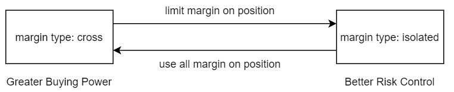

### Change Margin Type

> Response

```json
{
    "code": 0
}
```

You can change the margin type of a position:

* crossed margin (`crossed`) 
* isolated margin (`isolated`)





**HTTP Request**

<!-- 
@binance POST /fapi/v1/marginType
@bybit   POST ?
@OKEx    POST ?
-->

`POST /<grp>/api/pro/v2/futures/margin-type`

**Prehash String**

`v2/futures/margin-type`


**Request Parameters**

PARAMETER                             | TYPE   | REQUIRED | DESCRIPTION
------------------------------------- |--------| -------- | ---------------
symbol                                | String |  Yes     | e.g. `BTC-PERP`
[marginType](#margin-type-margintype) | ENUM   |  Yes     | You can switch between two margin types: `isolated` and `crossed`

